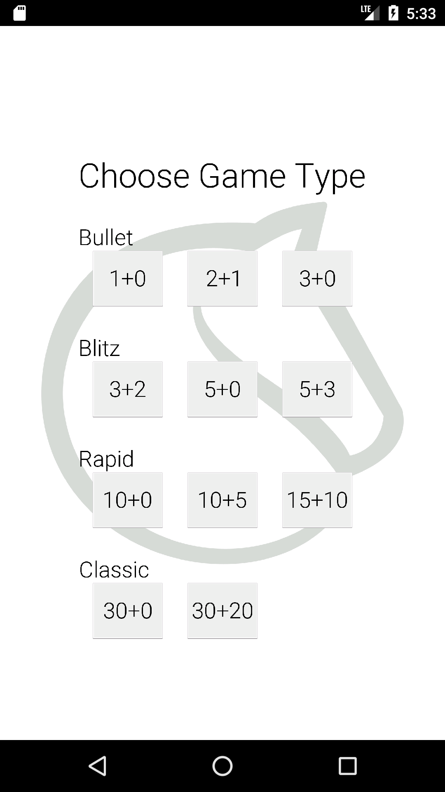
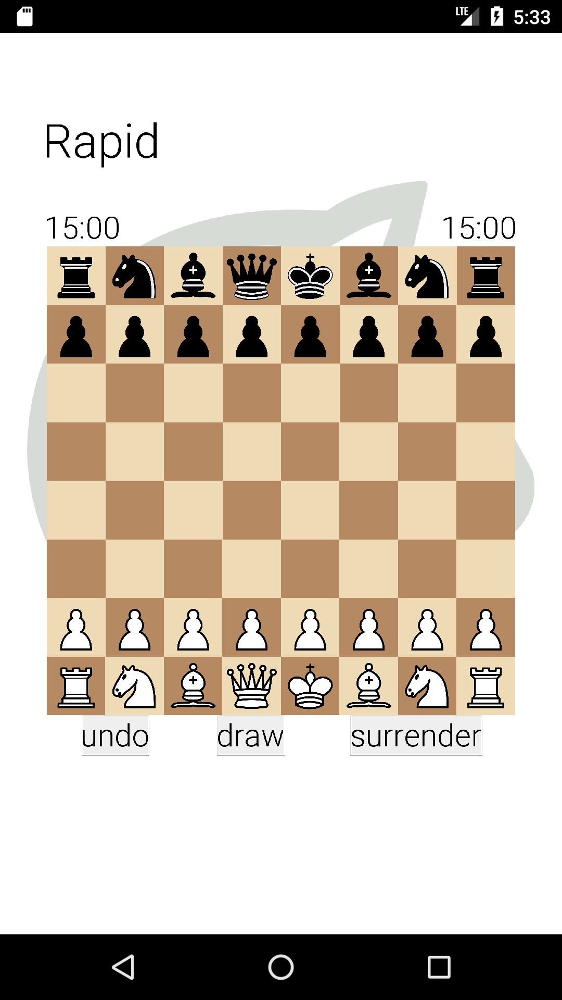

# Simple Chess Game

  

Simple version of the Chess Game

## Download
Ran out of time, sorry.

## Screenshots
 

## License: GPL3 (for the code, not assets) 

    Simple Chess Game with timer
    Copyright (C) 2020  Emmanuel Messulam

    This program is free software: you can redistribute it and/or modify
    it under the terms of the GNU General Public License as published by
    the Free Software Foundation, either version 3 of the License, or
    (at your option) any later version.

    This program is distributed in the hope that it will be useful,
    but WITHOUT ANY WARRANTY; without even the implied warranty of
    MERCHANTABILITY or FITNESS FOR A PARTICULAR PURPOSE.  See the
    GNU General Public License for more details.

    You should have received a copy of the GNU General Public License
    along with this program.  If not, see <https://www.gnu.org/licenses/>.

## License: GNU Affero General Public License 3 (for the assets, not the code) 

Lila is licensed under the GNU Affero General Public License 3 or any later version at your choice with an exception for Highcharts. See https://github.com/ornicar/lila/blob/master/COPYING.md for details.
